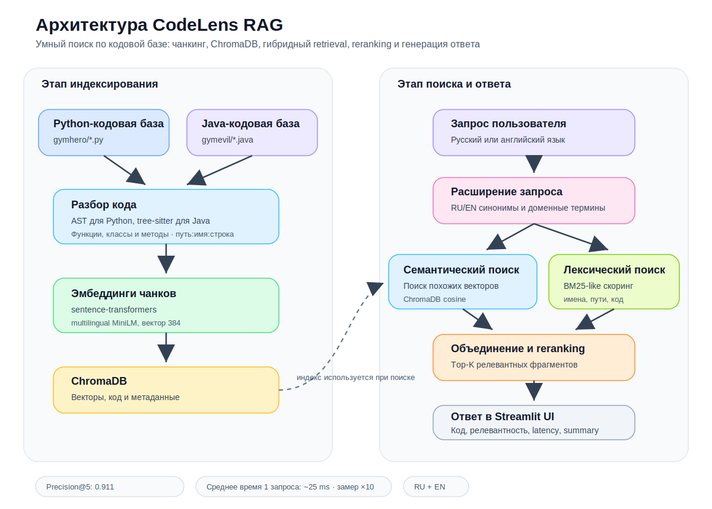

# CodeLens RAG — умный поиск по кодовой базе

**Команда:**

- Зелепухин Ярослав, студент группы 5130201/50302
- Волчанов Николай, студент группы 5130201/50302

***Санкт-Петербургский Политехнический Университет Петра Великого***

CodeLens RAG — прототип системы семантического и гибридного поиска по коду. Пользователь задаёт вопрос на русском или английском языке, а система находит релевантные функции, классы и методы в проекте, показывает код с подсветкой, объясняет найденные фрагменты и формирует краткий ответ по результатам поиска, если вопрос не связан с темой проекта, то будет выведено, что результатов по данному запросу нет.

---

## Архитектура



Система состоит из двух основных этапов: индексирование кодовой базы и поиск по построенному индексу.

### 1. Индексирование

Команда:

```bash
python index.py gymhero
```

Индексатор:

1\) обходит Python-файлы проекта;
2\) разбирает код через встроенный модуль `ast`;
3\) извлекает классы, функции и методы классов;
4\) формирует стабильные `chunk_id`;
5\) строит эмбеддинги через `sentence-transformers`;
6\) сохраняет документы, метаданные и векторы в ChromaDB.

Для создания эмбендингов была использована модель `MiniLM-L12-v2`, которая имеет вектор размерности 384, как и требовалось в задании. Данная модель была выбрана потому, что она показала хороший результат на прошлом этапе соревнования, а так как в этом задании мы можем усовершенствовать поиск, то модель идеально подходит, так как мы сможем дополнительными действиями довести поиск до около идеального. 

Дополнительно индексатор поддерживает Java-файлы (`.java`). Для Python используется встроенный модуль `ast`, а для Java используется `tree-sitter`, который преобразует всё в синтаксическое дерево, из которого потом формируются чанки.

Для проверки Java-поиска приложен отдельный проект `gymevil`. Его индекс создаётся отдельно, поэтому основной индекс `gymhero` не заменяется:

```bash
python index.py gymevil --persist-dir .codelens/java-demo
```

В визуальной оболочке можно указать проект Gymhero для Python или Gymevil. Также в ней можно менять по каким файлам будет проходить поиск.

Стратегия чанкинга:

> Один chunk = одна функция, класс или метод класса.

Такой подход выбран потому, что функция или метод обычно являются минимальной смысловой единицей кода: они имеют имя, аргументы, тело, документацию и отвечают за конкретное действие. Это даёт понятные `chunk_id`, хорошо подходит для поиска по естественному языку и совпадает с форматом оценки.

Формат `chunk_id`:

```text
{relative_path}:{name}:{start_line}
```

Пример:

```text
gymhero/security.py:create_access_token:12
```

### 2. Поиск

Поиск через интерфейс командной строки(CLI):

```bash
python search.py "как создаётся токен доступа и какой срок его жизни?"
```

Последовательность действий:

1\) пользователь вводит вопрос;
2\) запрос расширяется RU/EN-синонимами и доменными терминами;
3\) выполняется семантический поиск через ChromaDB;
4\) дополнительно выполняется лексический BM25-like поиск;
5\) кандидаты объединяются;
6\) reranker пересчитывает итоговый score;
7\) top-K фрагментов возвращаются в UI;
8\) модуль генерации ответов формирует краткое объяснение по найденным чанкам.

---

## Streamlit UI

Запуск:

```bash
streamlit run app.py
```

Интерфейс содержит:

- переключатель языка интерфейса: `Русский / English`;
- тёмную тему по умолчанию;
- поле для вопроса;
- демо-запросы;
- выбор проекта;
- режимы поиска `hybrid`, `semantic`, `lexical`;
- настройку веса semantic/lexical поиска;
- настройку `Top-K`;
- настройку числа кандидатов перед reranking;
- режимы генерации ответа: `off`, `extractive`, `ollama`;
- выбор модели ollama;
- карточки найденных фрагментов кода;
- оценка релевантности в процентах;
- семантическую и лексическую оценку;
- выделение ключевых слов запроса;
- кнопки копирования `chunk_id`, кода и сгенерированного ответа;
- историю последних запросов;
- панель метрики;
- индикатор текущего состояния запроса.

---

## Панель метрики

В интерфейсе отображаются:

- текущий `Precision@5` из `results.json`;
- среднее время поиска;
- количество проиндексированных чанков;
- количество файлов;
- используемая embedding-модель;
- наличие `results.json` и количество строк предсказаний;
- распределение eval-вопросов по языкам.

---

## Генерация ответа

В UI доступны режимы:

- `off` — только поиск по коду;
- `extractive` — краткий ответ по найденным фрагментам без внешней LLM;
- `ollama` — генерация ответа локальной LLM через Ollama.


Опциональный режим Ollama:

```bash
ollama serve
ollama pull mistral:7b
ollama pull qwen2.5:3b
```

После этого в UI можно выбрать режим `ollama` и одну из моделей: быструю `qwen2.5:3b` или более тяжёлую `mistral:7b`. Если Ollama недоступна, система остаётся полностью рабочей через `extractive`. Выбор разных моделей был добавлен, так как модель `mistral:7b` может быть слишком тяжёлой для некоторых устройств, поэтому было принято решение добавить более лёгкую модель `qwen2.5:3b`, чтобы была возможность узнать более детальный ответ даже на слабом устройстве.

---

## Оценка Precision@5

Запуск:

```bash
python evaluate.py --run-score
```

Система создаёт `results.json`, после чего запускает официальный скорер:

```bash
python score.py --predictions results.json --questions eval_questions.json
```

---

## Почему не только векторный поиск

Один только векторный поиск хорошо работает на простых вопросах, но хуже справляется со сложными, где важны конкретные сущности: `superuser`, `token`, `training_plan`, `database session`, `owner`, `pagination`. Поэтому добавлен гибридный поиск:

- semantic search - отвечает за смысловую близость;
- lexical search - усиливает точные совпадения имён функций, путей, классов и доменных терминов;
- query expansion - расширяет запрос синонимами и англо-русскими соответствиями;
- reranking - поднимает архитектурно важные фрагменты.

---

## Производительность поиска

При первом обращении система загружает embedding-модель, подключается к ChromaDB и формирует lexical index. Этот этап выполняется один раз при запуске поискового движка и занимает больше времени, чем последующие запросы.

После инициализации созданный экземпляр `CodeSearchEngine` переиспользуется. Для оценки скорости выполняется один прогревочный поиск, который не учитывается в метрике, а затем измеряется среднее время обработки 10 последовательных запросов.

Среднее время одного прогретого поиска составляет `~25–30 ms`. Метрика рассчитана по 10 последовательным запросам и не включает генерацию ответа через Ollama. Требование кейса `≤ 3 сек.` выполняется.

---

## Тёмная тема по умолчанию

Тема задаётся через файл:

```text
.streamlit/config.toml
```

Пример:

```toml
[theme]
base = "dark"
primaryColor = "#B794F4"
backgroundColor = "#0e1117"
secondaryBackgroundColor = "#262730"
textColor = "#fafafa"
font = "sans serif"
```

---

## Docker-запуск

```bash
docker compose up --build
```

После запуска Streamlit будет доступен в браузере на `http://localhost:8501`.

Docker нужен для воспроизводимого запуска проекта одной командой. При обычной локальной разработке можно запускать без Docker.

## Локальный запуск без Docker

```bash
python -m venv .venv
```

Windows PowerShell:

```powershell
.\.venv\Scripts\Activate.ps1
```

Установка зависимостей:

```bash
pip install -r requirements.txt
```

Индексирование:

```bash
python index.py <папка>
```

Запуск UI:

```bash
streamlit run app.py
```

Оценка:

```bash
python evaluate.py --run-score
```

---

## Примеры запросов

Ниже будут приведены возможные запросы и extractive-ответ к ним, для демонстрации используется Top-K при K = 3.

Как создаётся токен доступа и какой срок его жизни?

```
Наиболее релевантный фрагмент: gymhero/security.py:create_access_token:12.

По найденным chunk'ам можно опираться на следующие участки кода:

- gymhero/security.py:create_access_token:12 — create_access_token в gymhero/security.py:12-35 (score=0.667).
- gymhero/api/routes/auth.py:login_for_access_token:19 — login_for_access_token в gymhero/api/routes/auth.py:19-51 (score=0.507).
- gymhero/config.py:Settings:11 — Settings в gymhero/config.py:11-34 (score=0.217).
Это extractive-ответ без LLM: он не додумывает логику, а показывает, какие фрагменты нужно открыть для ответа на вопрос.
```

How does the project verify a JWT token from an incoming request?

```
Наиболее релевантный фрагмент: gymhero/api/dependencies.py:get_token:35.

По найденным chunk'ам можно опираться на следующие участки кода:

- gymhero/api/dependencies.py:get_token:35 — get_token в gymhero/api/dependencies.py:35-55 (score=0.863).
- gymhero/security.py:create_access_token:12 — create_access_token в gymhero/security.py:12-35 (score=0.524).
- gymhero/api/dependencies.py:get_current_user:58 — get_current_user в gymhero/api/dependencies.py:58-79 (score=0.475).
Это extractive-ответ без LLM: он не додумывает логику, а показывает, какие фрагменты нужно открыть для ответа на вопрос.
```

Где в проекте проверяется, является ли пользователь суперпользователем?

```
Наиболее релевантный фрагмент: gymhero/crud/user.py:UserCRUDRepository.is_super_user:25.

По найденным chunk'ам можно опираться на следующие участки кода:

- gymhero/crud/user.py:UserCRUDRepository.is_super_user:25 — UserCRUDRepository.is_super_user в gymhero/crud/user.py:25-35 (score=0.873).
- gymhero/crud/user.py:UserCRUDRepository:10 — UserCRUDRepository в gymhero/crud/user.py:10-86 (score=0.584).
- gymhero/crud/user.py:UserCRUDRepository.authenticate_user:67 — UserCRUDRepository.authenticate_user в gymhero/crud/user.py:67-86 (score=0.559).
Это extractive-ответ без LLM: он не додумывает логику, а показывает, какие фрагменты нужно открыть для ответа на вопрос.
```

How does the project prevent adding the same training unit to a plan twice?

```
Наиболее релевантный фрагмент: gymhero/crud/training_plan.py:TrainingPlanCRUD.add_training_unit_to_training_plan:11.

По найденным chunk'ам можно опираться на следующие участки кода:

- gymhero/crud/training_plan.py:TrainingPlanCRUD.add_training_unit_to_training_plan:11 — TrainingPlanCRUD.add_training_unit_to_training_plan в gymhero/crud/training_plan.py:11-34 (score=0.623).
- gymhero/api/routes/training_plan.py:add_training_unit_to_training_plan:325 — add_training_unit_to_training_plan в gymhero/api/routes/training_plan.py:325-377 (score=0.620).
- gymhero/api/routes/training_plan.py:remove_training_unit_from_training_plan:385 — remove_training_unit_from_training_plan в gymhero/api/routes/training_plan.py:385-442 (score=0.613).
Это extractive-ответ без LLM: он не додумывает логику, а показывает, какие фрагменты нужно открыть для ответа на вопрос.
```

Как в проекте реализована пагинация запросов к базе данных?

```
Наиболее релевантный фрагмент: gymhero/crud/base.py:CRUDRepository.get_many:53.

По найденным chunk'ам можно опираться на следующие участки кода:

- gymhero/crud/base.py:CRUDRepository.get_many:53 — CRUDRepository.get_many в gymhero/crud/base.py:53-85 (score=0.848).
- gymhero/crud/base.py:CRUDRepository.get_many_for_owner:189 — CRUDRepository.get_many_for_owner в gymhero/crud/base.py:189-215 (score=0.737).
- gymhero/api/routes/level.py:fetch_all_levels:23 — fetch_all_levels в gymhero/api/routes/level.py:23-42 (score=0.630).
Это extractive-ответ без LLM: он не додумывает логику, а показывает, какие фрагменты нужно открыть для ответа на вопрос.
```

Как пройти к метро?

```
По этому вопросу не найдено достаточно релевантных фрагментов кода. Возможно, такой функциональности в проиндексированном проекте нет. Попробуйте уточнить формулировку или выбрать другой проект.
```

---

## Структура проекта

```text
codelens_rag/
├── app.py                         # Streamlit-интерфейс
├── index.py                       # Индексация Python- и Java-проектов
├── search.py                      # Семантический и гибридный поиск
├── evaluate.py                    # Запуск оценки качества и latency
├── score.py                       # Расчёт Precision@5
├── eval_questions.json            # Тестовые вопросы
├── sample_queries.txt             # Примеры запросов
├── results.json                   # Результаты последней оценки
├── requirements.txt
├── Dockerfile
├── docker-compose.yml
├── .streamlit/
│   └── config.toml
├── codelens/
│   ├── __init__.py
│   ├── answering.py               # Extractive-ответы и интеграция с Ollama
│   ├── chunking.py                # Python AST и tree-sitter для Java
│   ├── embeddings.py              # Работа с embedding-моделью
│   ├── lexical.py                 # Лексический поиск и словарь синонимов
│   ├── query_expansion.py
│   └── reranker.py
├── gymhero/                       # Основная Python-кодовая база
├── gymevil/                       # Тестовая Java-кодовая база
│   └── src/
│       ├── Book.java
│       ├── CatalogService.java
│       └── LoanService.java
└── docs/
    └── architecture.svg
```

После индексации создаётся каталог `.codelens/`. В нём хранятся индексы ChromaDB для `gymhero` и `gymevil`. Каталог не добавляется в Git.

---

## Заключение

В ходе работы был сделан умный поиск по файлам с Java или Python кодом, который имеет визуальную оболочку, может использовать языковую модель для объяснения результата. Данный поиск можно запустить двумя командами:

```
python index.py gymhero
streamlit run app.py
```

Реализованный CodeLens RAG показывает следующие результаты:

- **Precision@5:** `0.911`
- **Среднее время одного прогретого поиска:** `~25-30 ms`
- **Индекс Python:** `155` AST-чанков из `35` Python-файлов.
- **Индекс Java:** `13` чанков из `3` Java-файлов.

Визуальная оболочка позволяет менять язык интерфейса, язык файлов, проверять время запроса, проверять тестовые вопросы, задавать собственные вопросы.

Проект также поддерживает воспроизводимый запуск через Docker Compose. При первом старте контейнер автоматически создаёт отдельные ChromaDB-индексы для Python-проекта `gymhero` и Java-проекта `gymevil`, после чего запускает Streamlit-интерфейс. При повторных запусках готовые индексы переиспользуются.

Также хочется отметить, что набор синонимов, которые реализованы в проекте является оптимальным, так как при их увеличении поиск начинает видеть связи там, где их нет, а при уменьшении наоборот не может распознать некоторые.

---

## Разбор проблемных вопросов

Итоговый `Precision@5` составляет `0.911`. Для `12` из `15` тестовых вопросов система находит все эталонные чанки. В трёх случаях часть нужных фрагментов не входит в первые пять результатов.

### Загрузка конфигурации окружения

**Вопрос:** `how does the project load configuration depending on the runtime environment?`

Найдены основные чанки:

- `gymhero/config.py:get_settings:65`
- `gymhero/config.py:Settings:11`

Не попал в top-5:

- `gymhero/config.py:LocalDevSettings:58`

Поиск корректно находит точку загрузки конфигурации и базовый класс настроек, но вместо `LocalDevSettings` поднимает другие связанные варианты окружения: `ContainerDevSettings` и `ContainerTestSettings`.

### Проверка уникальности плана тренировок

**Вопрос:** `как проверяется уникальность плана тренировок при его создании?`

Найдены:

- `gymhero/api/routes/training_plan.py:create_training_plan:192`
- `gymhero/models/training_plan.py:TrainingPlan:23`

Не попал в top-5:

- `gymhero/crud/base.py:CRUDRepository.get_one:33`

Проверка уникальности начинается в обработчике создания плана, поэтому он ранжируется высоко. Универсальный метод `get_one` расположен в базовом CRUD-репозитории и содержит меньше терминов, связанных именно с тренировочными планами, из-за чего уступает более предметным чанкам.

### Удаление плана владельцем или суперпользователем

**Вопрос:** `how does the project enforce that only the owner or a superuser can delete a training plan?`

Найден:

- `gymhero/api/routes/training_plan.py:delete_training_plan:229`

Не попали в top-5:

- `gymhero/api/dependencies.py:get_current_active_user:82`
- `gymhero/crud/user.py:UserCRUDRepository.is_super_user:25`

Это наиболее сложный вопрос: ответ распределён между несколькими модулями. Поиск уверенно находит endpoint удаления, но связанные проверки пользователя находятся в общих модулях авторизации и уступают чанкам, где явно встречаются операции удаления тренировочных сущностей.

Для повышения качества на подобных вопросах можно добавить анализ связей между чанками: учитывать вызовы функций, зависимости FastAPI и переходы между endpoint, CRUD-слоем и моделями. Это позволит поднимать связанные фрагменты даже в случаях, когда они используют разные термины.

---

## Короткий ответ на вопрос про чанкинг

> Мы режем код через AST на функции, классы и методы, потому что это минимальные устойчивые смысловые единицы Python-кода. Такой chunk содержит имя, аргументы, docstring и тело реализации, поэтому хорошо подходит для поиска по естественному языку и одновременно соответствует формату оценки `path:name:start_line`.
> Для Java используется `tree-sitter-java`: код преобразуется в синтаксическое дерево, из которого выделяются классы, интерфейсы, методы и конструкторы.

## Возможные улучшения

- подключить cross-encoder reranker для более точного ранжирования;
- добавить загрузку произвольного репозитория через UI;
- добавить сохранение пользовательских запросов в отдельный файл;
